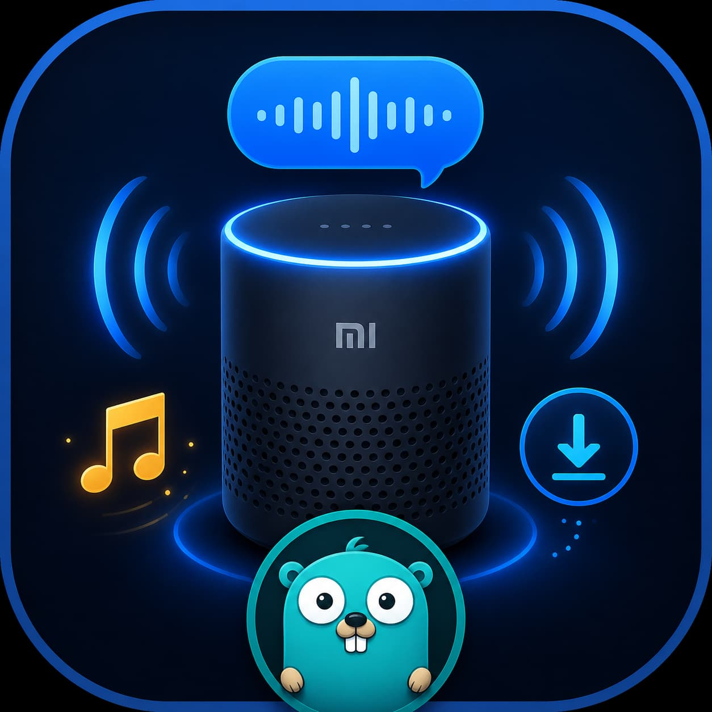

# Open-XiaoAI

把小爱音箱变成你自己的 AI 音箱。

Open-XiaoAI 通过运行在音箱上的 client 补丁程序，把小爱音箱的语音识别、音频输入、播放状态和远程执行能力交给你自己的 Server。你可以接入 Chat 类大模型、Gemini Live 实时语音模型，也可以让音箱播放本地音乐、网络音乐，并借助 LX Sync Server 搜索和下载歌曲。

当前重点维护的 `client-go`、`chat-go`、`gemini-go` 和 `music-go` 都是使用 Golang 重写的新版本，目标是减少运行时依赖，尽量用单二进制完成部署。



## 你可以用它做什么

- 接入 `chat-go`：把小爱音箱接到 OpenAI 兼容接口，支持 GPT、Claude、DeepSeek、通义千问等 Chat AI。
- 接入 `gemini-go`：把小爱音箱接到 Gemini Live API，走端到端实时语音对话。
- 启用 `music-go`：用语音播放本地歌曲、故事、有声书，支持上一首、下一首、随机播放、循环模式和自动切歌。
- 播放网络歌曲：本地曲库找不到时，调用 LX Sync Server 搜索歌曲并获取播放链接。
- 下载网络歌曲：开启 `music.lx.download` 后，通过 LX Sync Server 的代理下载能力把歌曲保存到本地目录，再播放本地文件。
- 自己扩展能力：Server 端收到音箱事件后可以接任意 AI、Agent、脚本或家庭自动化逻辑。

## 项目结构

`packages/client-go` 是运行在小爱音箱上的 Go 客户端，是旧版 client-rust 的 Golang 重写版本。它负责连接 Server、上报语音识别结果和播放状态、转发音频流，并响应 Server 发来的播放、TTS、Shell RPC 等指令。

`examples/chat-go` 是文本流式 + TTS 模式的 Go AI Server，是 MiGPT 类能力的 Golang 重写版本, 单二进制部署。用户说话后，Server 将语音识别文本发送给 OpenAI 兼容 API，流式接收回答，并逐句让小爱音箱播放 TTS。它适合接入 GPT、Claude、DeepSeek、通义千问等 Chat AI，也适合做关键词触发、可打断的语音助手。

`examples/gemini-go` 是 Gemini Live API 实时语音模式的 Go AI Server，是旧版 Gemini 示例的 Golang 重写版本, 单二进制部署。它把音箱麦克风 PCM 音频发给 Gemini Live，再把 Gemini 返回的 PCM 音频播放到音箱。它不依赖 TTS，适合更自然的实时语音对话。

`packages/music-go` 是可复用音乐模块，目前集成在 `chat-go` 中。它可以扫描本地音乐目录，建立曲库索引，响应“播放稻香”“下一首”“随便听听”等语音指令；本地找不到时，还可以通过 LX Sync Server 搜索、播放或下载网络歌曲。

整体链路：

```text
小爱音箱 client-go
  -> WebSocket
  -> chat-go / gemini-go / 自定义 Server
  -> AI 模型、LX Sync Server、本地音乐文件、脚本或其他服务
  -> 小爱音箱播放语音或音乐
```

## 选择哪个 Server

如果你想接入 ChatGPT、Claude、DeepSeek、通义千问等文本模型，优先使用 `chat-go`。它是文本流式 + TTS 模式，支持关键词触发、关键词/唤醒词打断、上下文历史、自定义回复，并且已经集成 `music-go`。

如果你想体验 Gemini Live API 的实时语音对话，使用 `gemini-go`。它是麦克风 PCM 到 Gemini Live，再到音箱 PCM 播放的实时音频链路。当前是半双工模式，AI 说话时不能中途打断。

如果你主要想让小爱音箱变成本地音乐播放器，使用 `chat-go + music-go`。`music-go` 会先搜索本地曲库；只要本地有命中，就播放本地文件，不会触发远程搜索。只有本地完全找不到普通歌曲时，才会进入 LX Sync Server 在线兜底。

## 核心能力

### chat-go：接入 Chat AI

`chat-go` 是推荐的通用 AI 助手入口。它支持 OpenAI 兼容的 Chat Completions 接口，因此可以接入：

- OpenAI GPT 系列
- Claude（可通过 OpenRouter）
- DeepSeek
- 通义千问
- 其他 OpenAI 兼容服务

它的特点：

- 文本流式输出，逐句 TTS 播放，响应更快。
- 支持按关键词触发 AI，避免小爱每句话都交给模型。
- 支持关键词或唤醒词打断正在播放的 AI 回复。
- 支持自定义固定回复，包括文字回复和音频 URL。
- 集成 `music-go`，可以同时做 AI 助手和音乐播放器。

文档：[`examples/chat-go/README.md`](examples/chat-go/README.md)

### gemini-go：接入 Gemini Live AI

`gemini-go` 面向实时语音对话。它不走文本 TTS，而是把小爱音箱麦克风音频直接送到 Gemini Live API，再把 Gemini 返回的音频播放出来。

它的特点：

- 端到端音频：16kHz PCM 输入，24kHz PCM 输出。
- Gemini 服务端 VAD，支持连续对话。
- 单 Go 二进制部署。
- 半双工设计：AI 说话时屏蔽麦克风，避免回声。

文档：[`examples/gemini-go/README.md`](examples/gemini-go/README.md)

### music-go：本地音乐、网络音乐与下载

`music-go` 是 `chat-go` 的音乐模块。启用后，你可以直接对小爱说：

```text
播放稻香
播放周杰伦
下一首
上一首
随便听听
单曲循环
全部循环
随机播放
停止播放
刷新曲库
```

它支持：

- 扫描本地音乐目录，提取歌名、歌手、专辑等元数据。
- 按歌名、歌手、专辑、文件名模糊搜索。
- 通过 HTTP 文件服务把本地音频 URL 发给小爱播放。
- 监听音箱播放状态，歌曲结束后自动切下一首。
- 支持故事/有声书，比如“播放西游记第 11 集”。
- 支持 LX Sync Server 在线兜底。

LX Sync Server 项目地址：[XCQ0607/lxserver](https://github.com/XCQ0607/lxserver)

配置示例：

```yaml
music:
  enabled: true
  dirs:
    - /path/to/music

  lx:
    enabled: true
    base_url: "http://localhost:9527"

    # 推荐使用普通用户 token，或配置 username/password 自动登录获取 token
    user_token: ""
    username: "your_lx_user"
    password: "your_lx_password"

    # 不建议日常播放依赖 admin 口令；保留仅用于兼容
    frontend_auth: ""

    # false: 直接播放 LX 返回的远程 URL
    # true:  通过 LX 代理下载到本地后播放
    download: true
    download_dir: ""  # 空则下载到 music.dirs[0]

    # LX 音源：kw=酷我，tx=QQ音乐，wy=网易云，kg=酷狗，mg=咪咕
    source: "kw"
    # 128k / 320k / flac，取决于源和歌曲
    quality: "128k"
```

本地优先规则：

- 如果你说“播放稻香”，本地曲库能找到《稻香》，就直接播放本地文件。
- 如果你说“播放周杰伦”，本地曲库里有周杰伦的歌，就播放本地搜索到的周杰伦歌曲列表。
- 如果本地没有《稻香》，你可以说“播放周杰伦的稻香”，`music-go` 会调用 LX Sync Server 搜索；若 `download: true`，会下载为 `稻香 - 周杰伦.mp3` 后播放。
- 只要本地有任何命中，就不会触发 LX 远程搜索或下载。

文档：[`packages/music-go/README.md`](packages/music-go/README.md)

## 快速开始

> [!IMPORTANT]
> 当前教程主要面向 **小爱音箱 Pro（LX06）** 和 **Xiaomi 智能音箱 Pro（OH2P）**。其他型号请不要直接套用，刷机和补丁过程可能不同。

### 1. 准备音箱

先刷机并开启 SSH：

```text
docs/flash.md
```

刷机教程：[`docs/flash.md`](docs/flash.md)

### 2. 在音箱上运行 client-go

`client-go` 负责连接你的 Server。下载和运行方式见：

```text
packages/client-go/README.md
```

常见运行方式：

```shell
/data/open-xiaoai/client ws://你的server地址:4399
```

如果你想同时运行 `gemini-go` 和 `chat-go`，可以使用切换模式：

```shell
/data/open-xiaoai/client -switch ws://你的IP:4399 ws://你的IP:4400
```

文档：[`packages/client-go/README.md`](packages/client-go/README.md)

### 3. 运行 chat-go

```shell
cd examples/chat-go
vim config.yaml
bash build.sh
./dist/chat-go -config config.yaml
```

默认监听 `ws://0.0.0.0:4399`。如果要和 `gemini-go` 同时运行，可以把 `chat-go` 改到 `4400` 端口。

文档：[`examples/chat-go/README.md`](examples/chat-go/README.md)

### 4. 运行 gemini-go

```shell
cd examples/gemini-go
vim config.yaml
bash build.sh
./dist/gemini-go -config config.yaml
```

需要先在 Google AI Studio 创建 Gemini API Key，也可以用环境变量 `GEMINI_API_KEY`。

文档：[`examples/gemini-go/README.md`](examples/gemini-go/README.md)

### 5. 启用 music-go

`music-go` 通过 `chat-go` 的 `config.yaml` 启用：

```yaml
music:
  enabled: true
  dirs:
    - /path/to/music
```

如果要播放和下载网络歌曲，再配置 `music.lx`，并单独启动 LX Sync Server。

## 旧版示例与更多能力

仓库里仍保留了一些历史示例和实验能力，可按需参考：

- [`examples/xiaozhi`](examples/xiaozhi/README.md)：小爱音箱接入小智 AI。
- [`examples/kws`](examples/kws/README.md)：自定义唤醒词。
- [`examples/migpt`](examples/migpt/README.md)：MiGPT 完美版示例。
- [`examples/gemini`](examples/gemini/README.md)：早期 Gemini 示例。
- [`examples/stereo`](examples/stereo/README.md)：小爱音箱组立体声。

## 相关项目

如果你不想刷机，或者设备型号不适合本项目，可以参考：

- [idootop/mi-gpt](https://github.com/idootop/mi-gpt)
- [idootop/migpt-next](https://github.com/idootop/migpt-next)
- [yihong0618/xiaogpt](https://github.com/yihong0618/xiaogpt)
- [hanxi/xiaomusic](https://github.com/hanxi/xiaomusic)
- [XCQ0607/lxserver](https://github.com/XCQ0607/lxserver)

## 参考链接

- [小爱音箱相关研究记录](https://github.com/yihong0618/gitblog/issues/258)
- [jialeicui/open-lx01](https://github.com/jialeicui/open-lx01)
- [duhow/xiaoai-patch](https://github.com/duhow/xiaoai-patch)
- [javabin.cn 小爱相关记录](https://javabin.cn/2021/xiaoai_fm.html)
- [xuanxuanblingbling IoT 文章](https://xuanxuanblingbling.github.io/iot/2022/09/16/mi/)

## 免责声明

1. **适用范围**  
   本项目为开源非营利项目，仅供学术研究或个人测试用途。严禁用于商业服务、网络攻击、数据窃取、系统破坏等违反《网络安全法》及使用者所在地司法管辖区法律规定的场景。

2. **非官方声明**  
   本项目由第三方开发者独立开发，与小米集团及其关联方无任何隶属或合作关系，亦未获其官方授权、认可或技术支持。项目中涉及的商标、固件、云服务的所有权利归属小米集团。若权利方主张权益，使用者应立即主动停止使用并删除本项目。

继续下载或运行本项目，即表示你已完整阅读并同意[用户协议](agreement.md)，否则请立即终止使用并彻底删除本项目。

## License

MIT License
